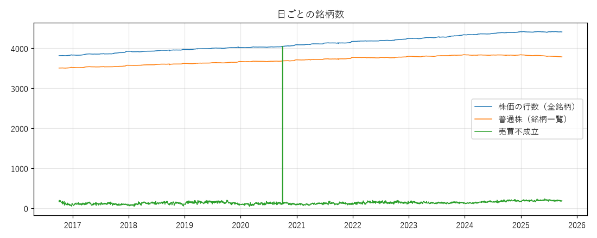

# フェーズ1 報告書：データ取得と品質チェック

作成：2026-10-04
対象期間：2016-10-05 〜 2025-09-28（ホールドアウト開始日 2025-09-29 の前日まで）

---

## 1. 結論

- **必要なデータはすべて、欠けなく取得できた。** 株価・銘柄一覧は 2,194 営業日すべて、財務情報・決算発表予定日は 3,281 暦日すべて、TOPIX は全営業日。
- **データの質は良好。** あり得ない値（マイナスの株価、安値 > 高値など）は 0 件。分割・併合の調整も正しく効いている。上場廃止した銘柄（759 銘柄）も含まれている。
- 大きな例外は1つだけで、**2020-10-01 は東証のシステム障害で終日売買が止まった日**（カレンダー上は営業日）。フェーズ2のバックテストでこの日の扱いを決める必要がある。
- **ホールドアウト開始日を 2025-09-29 に固定**し、それ以降のデータは取得も読み込みもしていない（プログラムで拒否する作り）。

---

## 2. 取得したデータ

| データ | 期間・件数 | 保存先（`data/raw/jquants/`） |
|---|---|---|
| 取引カレンダー | 2016-10-05〜2025-09-28（営業日 2,194、非営業日 1,052、祝日取引日 35） | `calendar/` |
| TOPIX 四本値 | 2,194 日（欠けなし） | `topix/` |
| 上場銘柄一覧（日付ごと） | 2,194 営業日。1日あたり 3,815〜4,414 銘柄 | `master/` |
| 株価四本値 | 2,194 営業日。1日あたり 3,813〜4,418 銘柄、のべ約900万行 | `bars/` |
| 財務情報（決算短信など） | 172,128 件（年に約1.9万件） | `summary/` |
| 決算発表予定日（変更履歴つき） | 138,974 件（年に約1.5万件） | `earnings_date/` |

- 合計で約 1.1 GB。取得にかかった時間は約2時間半。
- 取得のコマンド：`python -m src.data.fetch`。再実行すると、未取得の日だけを取る。保存済みのファイルは上書きしない。取得日時は各フォルダの `_fetch_log.csv` に残る。
- 取得の開始日 2016-10-05 は、Standard プランで取れる最古の日（2026-10-04 時点で 2016-10-04）の翌日（`docs/DECISIONS.md`）。

---

## 3. 品質チェックの結果

詳細な数字：`reports/phase1_quality.json`。グラフ：`reports/phase1_counts.png`。
再実行：`python -m src.analysis.phase1_quality`（例外の中身の確認は `python -m src.analysis.phase1_anomalies`）。

### 3.1 欠損
- 取得の対象日のうち、欠けた日は **0 日**（4種類のデータすべて）。
- 株価で、一部の列だけが空欄の行は 0 件。売買が成立しなかった日は、四本値・出来高・売買代金がそろって空欄（公式仕様どおり）。
- 売買不成立の割合：全銘柄で 3.3%、**普通株に限ると 1.3%**（2025年は 0.7%）。普通株のうち、期間の半分以上で売買が成立していない銘柄は 5 銘柄だけ（売買代金の条件でユニバースから外れる）。

### 3.2 異常値
- あり得ない値は **0 件**：マイナスや 0 の株価、安値 > 高値、始値・終値が高値〜安値の外、株価があるのに出来高 0、売買代金 ÷ 出来高（平均約定価格）が高値〜安値の外。
- ストップ高のフラグ 22,930 行、ストップ安のフラグ 5,613 行（バックテストの「買えなかった」「売れなかった」の判定に使う）。
- 分割・併合で調整した日次リターンが ±50% を超える日は 249 件（全体の 0.003%）。中身を確認すると、**データの誤りではなく実際の出来事**だった：
  - 249 件のうち、普通株は 139 件。全体では 218 件が上昇、31 件が下落で、170 件はストップ高・ストップ安のフラグつき。前回の約定から2営業日以上空いた（売買停止明けなど）のは 17 件
  - 大きな下落は、日本海洋掘削（2018年・会社更生法）、日本電解（2024年・民事再生法）、日医工（2022年）など、経営破綻・上場廃止の決定によるもの
  - 低い株価の銘柄は、値幅制限が株価に対して大きいため（例：100円未満は ±30円）、1日で ±50% を超えることがある
  - 普通株以外では、新株予約権証券や海外指数の ETF などの動き（ユニバースから外れる）

### 3.3 分割・併合の調整
- 調整係数（AdjFactor）が 1 でない日は 2,149 件・1,698 銘柄。2分割（0.5）が 920 件と最も多い。10株→1株の併合（10.0）の 359 件の多くは、2018年の売買単位100株への統一に伴うもの。
- 分割・併合の日の終値の変化率（中央値）は、**調整前が 66%、調整後が 1.9%**。調整後にリターンが ±50% を超えた日は 0 件で、調整が正しく効いていることを確認した。
- 【2026-10-04 追記・評価役の指摘】上の点検は売買が成立した日の係数だけで、売買不成立の日の係数 42 件が漏れていた。不成立の日も含めて点検し直すと、係数のある日をまたぐ調整後リターンが ±30% を超えるのは 7 件で、うち普通株は 4 件（本物の値動き 1 件、係数が株価の動きと合わないもの 3 件）。詳細と扱いの提案は `reports/phase1_review.md` の3章
- **調整の方法**：「終値 ÷ その日までの調整係数の累積積」でリターンを計算する（`src/analysis/phase1_quality.py` の `adjusted_returns`、テストあり）。API が返す「調整後の株価」の列は、その後の分割（ホールドアウト期間のものを含む）まで反映して計算し直されるため、使わない。（2026-10-04 追記：読み込みの時点で `Adj*` 列と `MktCap` 列を落とすようにした。`src/data/load.py`、テストあり）この方法なら、各時点までの情報だけで同じリターンになる。

### 3.4 上場廃止銘柄
- 期間中に株価が出てきた銘柄は 5,171。うち **759 銘柄は期間の途中で株価が終わっている**（上場廃止など。年に 42〜108 銘柄）。新しく上場した銘柄は年に 116〜188。
- 上場廃止した銘柄も、廃止の日までは日付ごとの銘柄一覧と株価の両方に含まれている。普通株のうち銘柄一覧にあって株価がない行、株価にあって銘柄一覧にない行は、どちらも 0。

### 3.5 日ごとの銘柄数の推移
- 普通株（下の判定）は 3,503（2016年）→ 最大 3,839 → 3,785（2025-09-26）と、なだらかに推移している。銘柄数が前の日より 10% 以上減った日はない。
- **例外：2020-10-01（木）**。営業日なのに、全銘柄で売買が成立していない。東証のシステム障害で終日売買が止まった日である（グラフの縦線）。

### 3.6 普通株の判定（PLAN.md で「フェーズ1で確認」としていた点）
次の3つをすべて満たすものを普通株とする（`docs/DECISIONS.md`）。
1. 商品区分が 011（内国株券）。ETF（014）、REIT（013）、外国株（021〜024）、優先出資証券（012）を除く
2. 市場区分が東証一部・二部・マザーズ・JASDAQ（〜2022年4月）か、プライム・スタンダード・グロース（2022年4月〜）。TOKYO PRO MARKET（プロ投資家向け）を除く
3. 銘柄コードの末尾が 0。内国株券の中の優先株式（伊藤園、ソフトバンクなど4銘柄）、新株予約権証券、「普通新株式」などを除く

実データでの確認：
- 内国株券のうち、上の市場区分以外にあるのは TOKYO PRO MARKET だけ（2025-09-26 で 151 銘柄）。期間中に一度も売買が成立しない銘柄の多くはここに含まれる
- 「その他」の市場区分（2025-09-26 で 465）は ETF・REIT など
- 普通株の数は東証の上場会社数（約3,800〜3,900社）とおおむね一致する

### 3.7 財務情報
- 開示時刻の形式はすべて正しい（形式の誤り 0 件）。開示番号の重複は 0 件。
- 開示時刻の分布：15:00 より前が 17%、**15:00〜15:30 が 42%**、15:30 以降が 41%。大引けの時刻が 2024-11-05 に 15:00 から 15:30 に変わったため、15:00〜15:30 の開示を「当日の引け後から使う」か「翌営業日から使う」かが時期によって変わる。CLAUDE.md 第5章のルールどおりに日付で分けて扱う（テストで確認する）。
- 土日の開示が 31 件（23 日）あった（暦日すべてを取得した理由）。祝日などを含めた営業日以外の開示は 43 件（33 日）（2026-10-04 追記。`phase1_quality.json` のキー名も件数と日数に分けた）。
- 時価総額の計算に使う発行済株式数の空欄は、決算短信の 0.13% だけ。
- 2025-09-26 時点の普通株のうち、過去1年に決算短信がある銘柄は 99.9%。

### 3.8 決算発表予定日
- 予定日が「未定」の記録は 0.4%。公表から予定日までの日数の中央値は 53 日。
- 予定日が公表日より前の記録が 1 件あったが、REIT（タカラレーベン・インフラ投資法人、2018年）で、ユニバースの対象外。
- 2025-09-26 時点の普通株のうち、過去1年に予定日の公表がある銘柄は 99.7%。

---

## 4. 懸念点・フェーズ2で決めること

1. **2020-10-01（終日売買停止）の扱い**：この日を買い・売りの日とする週（その週は 9/28〜10/2 で、10/1 は木曜）は、注文が約定しないものとして扱うのが基本ルールに沿う。特徴量の計算（過去N日）では、この日を売買不成立の日として扱う。フェーズ2で DECISIONS.md に記録する。
2. **データの最初の数か月の財務情報**：取得は 2016-10-05 からなので、それより前の決算短信（2016年8月の第1四半期など）はない。財務の特徴量は 2017年初めごろまで欠ける銘柄が多い。売買のバックテストは 2018-10-01 から始めるため、影響は学習データの最初の部分に限られる。
3. **監理・整理銘柄**：J-Quants の銘柄一覧には区分がない。破綻した銘柄は、上場廃止が決まった後も整理銘柄としてしばらく売買されるため、予測上位に入る可能性がある（下落した後の反発を狙うリバーサルなど）。PLAN.md 第5章の未決事項として、フェーズ2で扱いを決める。
4. **±50% を超える日の扱い**：実際の出来事なので、データは削除・修正しない。目的変数（順位）や特徴量では外れ値の影響が出るため、フェーズ2・3で順位化などで扱う。
5. **データの量**：約 1.1 GB。読み込みにかかる時間は数十秒程度で、問題ない。フェーズ2では、加工済みデータを `data/processed/` にまとめて保存し、読み込みを速くする予定。

---

## 5. 記録しておくこと

- ホールドアウト開始日：**2025-09-29（月）**（`config/base.yaml`、以後変更しない）。開発用の最後の週は 2025-09-22〜26。
- 下調べで1回だけ、決算発表予定日を銘柄コード指定で取得し、ホールドアウト期間（〜2026-09-28）の公表日の範囲と件数が画面に表示された。中身は見ておらず、保存もしていない。ユーザーに報告し、了承を得た。以後はコード指定を使わない作りにした。
- 取得の途中で、作業用の実行環境の制限（2時間）により取得が2回止まった。保存は「一時ファイル → 名前の変更」で行う作りのため、壊れたファイルは残っていない（確認済み）。続きは同じコマンドで取得した。
- テスト：22件すべて成功（取得・読み込みのホールドアウト拒否、上書き禁止、未取得分だけの取得、分割調整、普通株の判定など）。

## 6. 次にやること

- **ユーザーの指示により、ここで止まる。** 結果を確認していただいてから、フェーズ2（ユニバース・目的変数・バックテスト基盤）に進む。
