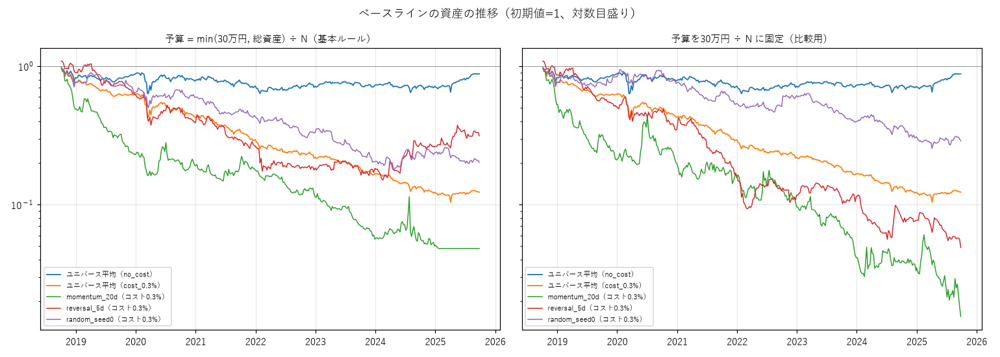
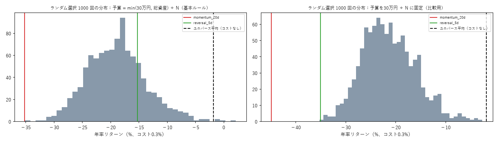

# フェーズ2 報告書：ユニバース・目的変数・バックテスト基盤

作成：2026-10-04
対象期間：売買は 2018-10-01 の週から 2025-09-22〜26 の週まで（364週。予測日は 2018-09-28〜）。ホールドアウト（2025-09-29〜）は読み込んでいない
数字の出典：`reports/phase2_baselines.json`（`python -m src.analysis.phase2_baselines`、ランダム1,000回で約64分）、`reports/phase2_delisting_signal.json`（`python -m src.analysis.phase2_delisting_signal`）

---

## 1. 結論

- **バックテスト基盤は完成し、テスト42件がすべて通った。** 売買記録から計算した資産と最終資産が一致し、約定価格が元データの始値・終値と一致することも確認した。
- **4つのベースラインは、コスト差し引き後にすべて大きなマイナスだった。** 主な原因は売買コストで、毎週売買し直すと、コストだけで年率約17ポイント押し下げられる（ランダム選択：コストなし −1.9%、コスト0.3% −18.9%）。
- ユニバース平均（コストなし）も年率 −1.8% で、この期間・この売買のタイミング（月曜の寄付〜金曜の引け、配当なし）では、小型株を持つだけでは増えなかった。
- **承認をお願いしたいことが4つある**（第8章）。①継続保有の判断の時点（基本ルールの文面には時間の矛盾がある）、②貸借信用区分「その他」の銘柄をユニバースから除く、③比較する売買ルールの候補に「保有期間を2週・4週にする」を加える（モデルの結果を見る前の事前登録）、④比較用に「予算固定」の成績を併記する扱い。

---

## 2. 作ったもの

| 部品 | ファイル | 内容 |
|---|---|---|
| 日付×銘柄の行列 | `src/backtest/market.py` | 普通株の株価・売買代金・ストップ高安・調整係数・発行済株式数。`data/processed/` に保存（約1分で作り直せる） |
| 開示の利用開始日 | `src/data/disclosure.py` | 大引け（2024-11-05 以降 15:30、それより前 15:00）より前なら当日、以降・休日なら翌営業日 |
| ユニバース | `src/backtest/universe.py` | 普通株、時価総額500億円以下、20日平均売買代金3,000万円以上、株価50円以上。予測日ごとに 814〜1,478銘柄（中央値1,076） |
| 目的変数 | `src/backtest/target.py` | 翌営業日の始値 → 5営業日後の終値 のリターンの、ユニバース内の順位 |
| 約定判定・株数 | `src/backtest/execution.py` | 呼値、指値、100株単位、売買代金の上限、ストップ高・ストップ安、分割の日 |
| 週次のバックテスト | `src/backtest/engine.py` | 第5章の基本ルール。継続保有の方式と予算の決め方を設定で切り替えられる |
| ベースライン・指標 | `src/backtest/baselines.py`・`metrics.py` | 4つのベースライン、年率、最大ドローダウン、シャープレシオ、Rank IC、年ごと・相場環境ごと、税引き後 |

細部の判断（売買代金0の扱い、発行済株式数の分割調整、売れなかった判定、配当を含めないことなど）は `docs/DECISIONS.md`（2026-10-04 のフェーズ2の項目）に記録した。

### テスト（42件、すべて成功）
- 約定判定：始値 = 指値は買えない、寄らずは買えない、分割の日は買えない、ストップ安で引けたら売れず翌営業日の始値で売る
- 株数：100株単位、予算ちょうど、100株も買えない銘柄・売買代金の上限を超える銘柄は飛ばして次の順位へ
- 呼値の境目（3,000円・5,000円・30,000円）と、浮動小数点の誤差で1円ずれないこと
- 開示の利用開始日（15:00 と 15:30 の境目、休日、最終日の引け後）
- 未来情報の混入：予測日より後のデータを消しても、ユニバース・点数・注文が変わらない
- 継続保有の3方式、1日しかない週、終日の売買停止（2020-10-01 の扱い）、分割、上場廃止、予算固定

---

## 3. ベースラインの成績（コスト片道0.3%、継続保有は暫定の `prev_day`）

超過リターン＝戦略の年率 − ユニバース平均（コストなし）の年率。ランダムは1,000回の平均。

### 3.1 基本ルール（予算 = min(30万円, 総資産) ÷ 3）

| 戦略 | 年率 | 超過 | シャープ | 最大DD | 1週の最大損失 | 約定率 | 現金の週 | 超過がプラスの年 |
|---|---|---|---|---|---|---|---|---|
| ランダム（1,000回の平均） | −18.9% | −17.1% | −0.70 | −81% | — | 84% | 1.9% | — |
| モメンタム（20日の上昇率が高い順） | −35.2% | −33.4% | −0.84 | −95% | −44% | 67% | 10.4% | 8年中1年 |
| リバーサル（5日の下落率が大きい順） | −15.3% | −13.5% | −0.29 | −86% | −25% | 78% | 3.3% | 8年中2年 |
| ユニバース平均（コストなし） | −1.8% | — | 0.01 | −37% | −18% | 91% | — | — |
| ユニバース平均（コスト0.3%） | −25.9% | — | −1.42 | −90% | — | 91% | — | — |

- ランダム1,000回の年率の分布：5%点 −26.9%、中央値 −18.9%、95%点 −9.9%。モメンタムは分布の下端（0パーセント点）、リバーサルは78パーセント点。
- コストなし：ランダム −1.9%、モメンタム −28.9%、リバーサル −14.7%。コスト0.5%：ランダム −26.1%、モメンタム −35.2%、リバーサル −22.8%。

### 3.2 比較用：予算を30万円 ÷ 3 に固定（ご依頼の2点目）

毎週、資金を30万円に戻したとみなし、その週の損益 ÷ 30万円 を週次リターンとする（現金のマイナスは補充したとみなす）。

| 戦略 | 年率 | 超過 | シャープ | 最大DD | 注文の順位の平均 | 指値の中央値 |
|---|---|---|---|---|---|---|
| ランダム（1,000回の平均） | −21.3% | −19.5% | −0.87 | −83% | — | — |
| モメンタム | −44.9% | −43.1% | −0.64 | −98% | 5.1位 | 515円 |
| リバーサル | −35.0% | −33.2% | −0.95 | −96% | 3.9位 | 474円 |

- 基本ルールでは、負けて総資産が減ると予算が縮み、50円台の超低位株しか買えなくなる。モメンタムでは**注文の順位の平均が105.9位、指値の中央値が114.5円**まで下がり、2024年末以降は資金が初期の約5%になって何も買えなくなった（`reports/phase2_equity.png` の左）。予算固定では順位5.1位・515円で、本来の選び方に近い。
- リバーサルは、基本ルール（−15.3%）の方が予算固定（−35.0%）より成績が良く見える。これは超低位株に押し出された経路の影響で、戦略の実力ではない。**戦略どうしの比較は予算固定の数字で行い、基本ルールの数字は「実際の口座ならこうなる」として併記する**ことを提案する。

### 3.3 Rank IC（予測の順位と翌週の実際の順位の相関、週次・重ならない期間）

| 点数 | 平均 | 平均 ÷ 標準偏差 | t値 |
|---|---|---|---|
| モメンタム（20日） | −0.031 | −0.26 | −5.0 |
| リバーサル（5日） | +0.039 | +0.38 | +7.2 |

- リバーサルの IC は強いプラスだが、**上位3銘柄の売買はコストなしでも負けた**。順位を10等分して調べると、IC は主に「直近で大きく上がった銘柄（下位10%）が翌週 週 −0.53% と下がる」側から来ており、「大きく下がった上位3銘柄」の翌週は平均0%・中央値 −0.9%だった。上位には上場廃止に向かう銘柄も混ざる（第4章）。
- フェーズ4への示唆：**IC が良くても、上位数銘柄の成績は別物になりうる**。上位の数銘柄だけを買う運用では、上位の分位の成績を必ず確認する。

### 3.4 相場環境ごと（ユニバース平均・コストなし、週平均）
上昇（四半期の TOPIX +5% 超）145週：+0.42%、横ばい181週：−0.14%、下落38週：−0.88%。

---

## 4. 監理・整理銘柄（ご依頼：問題の大きさ、その時点の情報で見分ける方法）

### 4.1 問題の大きさ：選んでから30営業日以内に上場廃止になった割合
（予測日 + 30営業日がデータの外になる、2025年8月以降の選択は数えていない）

| 選び方 | 選択の数 | 30営業日以内に廃止 | 割合 | 予測日 → 最後の終値（中央値） |
|---|---|---|---|---|
| ユニバース全体 | 389,667 | 932 | 0.24% | 0% |
| ランダム（1,000回、注文した銘柄） | 1,041,293 | 2,835 | 0.27% | −11% |
| モメンタム（注文した銘柄） | 482 | 1 | 0.21% | −8% |
| **リバーサル（注文した銘柄）** | 946 | **16（うち約定13）** | **1.69%** | **−41%** |
| リバーサル（予算固定、注文した銘柄） | 980 | 10（うち約定9） | 1.02% | −35% |

- **リバーサルではユニバース全体の約7倍**で、廃止までに −40% 前後下がる銘柄が多い。同じ銘柄を何度も選んだ例もある（佐渡汽船：2022年3〜4月に4回選び、それぞれ廃止まで −40〜−62%）。日医工（2023年）、日本電解（2024年、−97%）など、整理銘柄とみられる銘柄が入っている。
- 「下がった銘柄を選ぶ」性質のモデルでは、同じ問題が起きる可能性が高い。フェーズ4でモデルの予測上位についても同じ集計を行う。
- この集計は判断材料にだけ使い、売買のルールには使っていない（上場廃止の日は後から分かる情報のため）。

### 4.2 その時点の情報で見分ける方法：貸借信用区分「その他（3）」
- J-Quants の銘柄一覧の貸借信用区分（1:信用、2:貸借、3:その他）。公式仕様では、日付を指定するとその時点の情報が返る。日付 d の一覧は前の営業日の 17:30 頃に公開されるので、**予測日 p の一覧は p の引け後に確実に分かる**（未来情報にならない）。東証が監理・整理銘柄の信用取引を止めるため「その他」に変わると考えられる。

| 確認したこと | 結果 |
|---|---|
| 上場廃止になった普通株616銘柄のうち、最後の上場日に「その他」 | **423銘柄（69%）** |
| 「その他」に変わってから最後の上場日まで | 中央値 **16営業日**（10%点 10日、90%点 21日。95%が10営業日以上前） |
| 「その他」で見つからなかった廃止（31%） | 最後の20営業日の値動きの中央値 5.6%。合併・株式交換など、相手の株に置き換わる種類が多いとみられる |
| 「その他」で見つかった廃止 | 最後の20営業日の値動きの中央値 0.1%（TOB で株価が買付価格に張り付く種類が中心）。−20%を超えて動いたものは7% |
| 予測日のユニバース内の「その他」 | のべ1,290件。うち30営業日以内に廃止 21%、250営業日以内に 24%。「その他」以外の銘柄は 0.17% |
| リバーサルの上位3で30営業日以内に廃止した9件 | **7件は予測日に「その他」だった** |
| 誤検出の中身 | 新規上場の直後（1日程度、780回）と、債務超過などで**上場廃止の猶予期間に入った銘柄**（ホープ、倉元製作所、旅工房、タカキュー、ポプラなど。1年以上「その他」のままのことがある） |

### 4.3 【承認のお願い】提案：予測日に貸借信用区分が「その他」の銘柄をユニバースから除く
- **何を変えるか**：ユニバースの条件に「予測日の銘柄一覧で、貸借信用区分が『その他（3）』でない」を加える。保有中の銘柄が「その他」になったら、承認済みのルール（ユニバースから外れた保有銘柄は売る）により、その週の最終営業日に売る
- **除外される銘柄の数（予測日ごと）**：ユニバース内で **平均3.7銘柄（中央値3、90%点7、最大14）**、ユニバースの約0.3%。364週のうち356週で1銘柄以上。100株を買える銘柄（N=3で指値1,000円以下）に限ると平均3.0銘柄（中央値3、最大12）、約0.6%。年ごとの平均：2018年 2.4、2019年 1.9、2020年 2.5、2021年 4.2、2022年 3.9、2023年 3.4、2024年 3.5、**2025年 7.8**（TOB・MBO が増えた時期と重なる）
- **なぜ改善になると考えるか**：整理銘柄（廃止まで大きく下がる）と、TOB 後の値動きのない銘柄（買っても利益が出ず、コストだけかかる）を、その時点の情報で外せる。除外の対象は毎週3〜4銘柄と少ない
- **リスク・成績が実力以上に良く見える可能性**：区分は公式仕様では時点ごとの値だが、過去の一覧が後から書き換えられていないかは J-Quants の説明だけでは完全には確かめられない（廃止の日付から逆算していないことは、変わった日が廃止の10〜21営業日前に分布していることから推測できる）。猶予期間の銘柄も外れるため、経営不振からの反発で利益が出た銘柄も外す。予測日の翌営業日の一覧（予測日の 17:30 に公開）を使えばもう1日早く分かるが、8:00 の更新で中身が変わる可能性があるため使わない（保守的に予測日の一覧だけ）
- 採用する場合は、フェーズ3の前に実装し、ベースラインを計算し直す（4つとも同じユニバースで）

---

## 5. 【承認のお願い】継続保有の判断の時点（基本ルールの文面の矛盾）

- **問題**：基本ルールは「翌週も上位N銘柄に選ばれた保有銘柄は売らない」。しかし翌週の上位Nは最終営業日の**引け後**の予測で決まり、引成の売り注文はその日の**引け前**（楽天証券では11:30〜15:00）に入れる必要がある。文面どおりに再現すると、引け値を見てから引けで売るかを決めることになり、実際には発注できない（わずかな未来情報の混入）
- **提案**：**最終営業日の前の営業日（通常は木曜）の引け後の順位で、継続するかを判断する（`prev_day`）**。継続を判断するときの「上位N」では、保有銘柄は100株を買えるかの判定なしで数える。ユーザーの作業は「木曜の夜に継続・売却の一覧を確認」が増える（週次の注文リストは今までどおり金曜の夜〜週末）
- 3方式の比較（コスト0.3%、年率）：

| 予算 | 戦略 | 毎週すべて売る（none） | 前日の順位（prev_day、提案） | 文面どおり（same_day、実行不可） |
|---|---|---|---|---|
| 基本 | ランダム（100回の平均） | −19.7% | −19.7% | −19.9% |
| 基本 | モメンタム | −34.7% | −35.2% | −35.1% |
| 基本 | リバーサル | −16.3% | −15.3% | −17.2% |
| 固定 | ランダム（100回の平均） | −21.5% | −21.3% | −21.3% |
| 固定 | モメンタム | −49.1% | −44.9% | −42.2% |
| 固定 | リバーサル | −29.8% | −35.0% | −32.3% |

- 文面どおり（実行不可）と提案の方式の差は小さく、どちらかが一方的に良いわけではない。売買の回数は継続保有で減る（モメンタム・予算固定：none 1,540回 → prev_day 900回）が、上位が毎週入れ替わる戦略では節約の効果は小さい
- 他の選択肢：週の予測自体を木曜の引け後に移す（予測が1日古くなる）、継続保有をやめる（`none`）

---

## 6. 【承認のお願い】比較する売買ルールの候補に「保有期間を2週・4週にする」を加える（事前登録）

モデルの結果を見る前に提案する（ご依頼）。

- **何を変えるか**：第5章の「比較する売買ルールの候補」に9番目として追加する
  - **9. 保有期間**：予測と買いを H 週ごと（H = 2・4）に行い、買った週から H 週目の最終営業日の引けで売る。継続保有は基本ルールと同じ（次の予測日の上位N銘柄に入れば売らない。判断の時点は第5章の承認結果に従う）。予測・指値・株数・コスト・約定の判定は基本ルールと同じ。間の週は何もしない
  - モデルは基本の方法と同じもの（5営業日の目的変数で学習）を使い、売買のルールだけを変える（1項目ずつ変える原則のため）。目的変数の期間を保有期間に合わせる案は、別の変更として扱う（必要なら改めて承認をお願いする）
  - どの週から始めるかで結果が変わるため、H 通りの開始週をすべて計算し、その平均と、最も良い・悪い開始週を併記する（良い開始週だけを選ばない）
  - 地合いフィルター・決算の回避と組み合わせる場合の判定は、予測日（H 週ごと）に行う（組み合わせの総当たりはしない）
- **なぜ改善になると考えるか**：コストは売買の回数に比例する。毎週売買し直すと往復0.6% × 52週で単純計算では年31%（実測でもランダム選択の成績を年率約17ポイント押し下げた）。H = 2 で約半分、H = 4 で約4分の1になる。今回のベースラインでは、コストなしならランダム選択がユニバース平均とほぼ同じ（−1.9% 対 −1.8%）なので、コストの削減は成績に直接効く
- **リスク・成績が実力以上に良く見える可能性**：
  - 予測は5営業日先を当てるように学習するため、保有期間が長いと予測の効き目が薄れる（コストの節約を予測の劣化が上回る可能性がある）
  - 開始週の違いで成績がばらつく。開始週を選ぶと過学習になるため、全開始週の平均で判断する
  - 比較する候補が9つに増え、同じ検証データでの試行回数が増える（20回を超えたら警告するルールは維持する）
  - 保有期間中に決算発表・権利落ち・上場廃止に当たる確率が上がる。損切りの逆指値は権利付最終売買日をまたぐと失効するため、入れ直しが増える

---

## 7. 懸念点

1. **コストの重さ**：週次で毎週入れ替える戦略は、コストだけで年率約17〜25ポイント不利になる。モデルがこれを上回るのはかなり難しい。第6章の保有期間の候補は、この対策として重要
2. **ユニバース平均がマイナス**：月曜の寄付〜金曜の引けで測るため、週末をまたぐ値動きと配当（年2%前後）を含まない。「小型株を持ち続けた場合」より低く出ている。データ費用の合格基準（ユニバース平均を上回る）の比較相手としては甘めになる点に注意する
3. **予算の決め方による経路依存**：第3.2節のとおり。戦略の比較は予算固定で行うことを提案する
4. **ベースラインの約定率**：モメンタムは67%（上がった銘柄は寄付で窓を開けやすく、指値で買えない）。予測が「上がりそうな銘柄」を選ぶほど約定率が下がる可能性がある
5. **ランダム1,000回の計算時間**：約64分。フェーズ4で比較のたびに回すのは重いため、モデルの比較では既存の分布（`phase2_baselines.json`）を使い、売買ルールを変えたときだけ回し直す
6. **配当を含めない**：J-Quants の株価は配当で調整されないため、すべての戦略・ベースラインで配当を含めていない（DECISIONS.md）

---

## 8. 承認をお願いしたいこと（まとめ）

1. **このバックテスト基盤（第2章）とベースラインの成績（第3章）を、以降の比較の基準として使ってよいか**
2. **継続保有の判断を「最終営業日の前の営業日の引け後の順位」で行う（`prev_day`）**（第5章。CLAUDE.md 第5章の文面の修正が必要）
3. **貸借信用区分「その他」の銘柄をユニバースから除く**（第4.3章。CLAUDE.md 第5章・`config/base.yaml` のユニバース条件に追加）
4. **比較する売買ルールの候補に「9. 保有期間（2週・4週）」を事前登録として加える**（第6章。CLAUDE.md 第5章に追加）
5. **戦略どうしの比較は予算固定の成績で行い、基本ルールの成績を併記する**（第3.2節）

---

## 9. 次にやること（承認後）

- 承認された変更を CLAUDE.md・`config/base.yaml` に反映し、2・3を実装してベースラインを計算し直す
- フェーズ3（特徴量）へ進む。各特徴量がその時点で入手可能な情報だけで作られていることをテストで確認する
- フェーズ4では、モデルの予測上位について、上場廃止の割合（第4.1節と同じ集計）と、上位の分位の成績を報告する
- フェーズ2の区切りなので、新しいセッションに切り替えることを提案する（会話が長くなったため）
