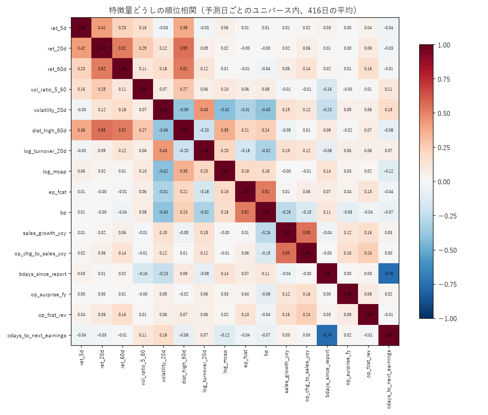

# フェーズ3 報告書：特徴量

作成：2026-10-04
数字の出典：`reports/phase3_features.json`・`reports/phase3_corr.png`（`python -m src.analysis.phase3_features`）、`reports/phase2b_baselines.json`（`python -m src.analysis.phase2_baselines --prefix phase2b`）

---

## 1. 結論

- **CLAUDE.md 第7章フェーズ3の特徴量（第1段階7個・第2段階9個、計16個）を、名前で登録して作った。** 組の名前は `all_v1`。
- **未来情報が混入していないことを、3通りのテストで確認した。** (1) ダミーデータで、予測日より後のデータを消しても値が変わらない、(2) 実データの2つの予測日（2019-03-29、2024-11-06）で同じ確認、(3) 実データの300件（無作為の日付×銘柄）で、開示の利用条件を素朴に書き直した計算と一致。故意に未来の情報を混ぜると (1) のテストが失敗することも確かめた。
- フェーズ2の承認3（貸借信用区分「その他」をユニバースから除く）を実装した。除外後のベースラインは第4章。
- フェーズ4の学習の準備（学習用データの組み立て、ウォークフォワードの期間の分割）まで作った。**モデルの学習・評価は、ご指示どおり評価役の確認が終わるまで行っていない。**
- 特徴量と翌週のリターンの関係（Rank IC など）は、フェーズ3では見ていない。結果を見て特徴量を選ぶと過学習になるため、取捨はフェーズ4で事前登録した実験として行う。

---

## 2. 作った特徴量

すべて、予測日 t の引け後に入手できた情報だけで計算する。株価は分割・併合を調整した値を使う。

### 2.1 第1段階（値動き）`price_v1`

| 名前 | 内容 |
|---|---|
| `ret_5d`・`ret_20d`・`ret_60d` | 過去5・20・60営業日の上昇率 |
| `vol_ratio_5_60` | 出来高の変化率：log(5日平均 ÷ 60日平均)（分割調整した出来高） |
| `volatility_20d` | 値動きの大きさ：20日の日次リターンの標準偏差 |
| `dist_high_60d` | 直近高値からの距離：終値 ÷ 60日の高値 − 1 |
| `log_turnover_20d` | 売買代金：20日平均の対数 |

### 2.2 第2段階（財務・イベント）`fundamental_v1`

| 名前 | 内容 |
|---|---|
| `log_mcap` | 時価総額の対数（ユニバースの判定と同じ、開示済みの発行済株式数 × 終値） |
| `ep_fcst` | 予想PERの逆数：会社予想の通期純利益 ÷ 時価総額 |
| `bp` | PBRの逆数：純資産 ÷ 時価総額 |
| `sales_growth_yoy` | 売上高の前年同期比 |
| `op_chg_to_sales_yoy` | 営業利益の前年同期からの増加額 ÷ 前年同期の売上高 |
| `bdays_since_report` | 決算発表からの営業日数 |
| `op_surprise_fy` | 本決算の上振れ・下振れ：(実績の営業利益 − 直前の会社予想) ÷ 売上高 |
| `op_fcst_rev` | 会社予想の修正幅：(最新の予想の営業利益 − 1つ前の予想) ÷ 予想の売上高 |
| `cdays_to_next_earnings` | 次の決算発表予定までの暦日数 |

主な判断（詳細と理由は `docs/DECISIONS.md` 2026-10-04）：
- **PER・PBR は逆数にした。** 赤字の会社では PER の符号が反転し、順位が意味を持たないため。
- **営業利益の伸びは「増加額 ÷ 前年の売上高」にした。** 赤字をまたぐと伸び率（%）が計算できないため。
- **決算発表予定日は、公表日の次の営業日から使う。** J-Quants の記録には公表の時刻が無く、更新が翌朝のため、公表日当日の引け後に使うと未来の情報になるおそれがある（保守的な扱い）。
- 開示情報（決算短信・業績予想の修正）は CLAUDE.md 第5章のとおり、大引け（2024-11-05 以降は15:30、それより前は15:00）より前の開示は当日の引け後から、それ以降は翌営業日の引け後から使う。15:00〜15:30 の開示（全体の42%）の扱いが時期で変わることもテストで確認した。

---

## 3. 特徴量の集計（2017-01〜2025-09 の予測日 454日、ユニバース内）

ユニバースの銘柄数の中央値は 1,057。

| 名前 | 値のある割合（平均） | 最小（日付） | 中央値 | 5%点〜95%点 |
|---|---|---|---|---|
| ret_5d | 100% | 100% | 0.0% | −10.3%〜11.9% |
| ret_20d | 100% | 99.8% | 0.1% | −19.6%〜27.7% |
| ret_60d | 99.2% | 97.7% | 1.3% | −29.6%〜52.7% |
| vol_ratio_5_60 | 99.2% | 97.8% | −0.16 | −1.17〜1.02 |
| volatility_20d | 100% | 99.8% | 2.4% | 1.0%〜6.4% |
| dist_high_60d | 99.2% | 97.8% | −12.7% | −39.3%〜−1.2% |
| log_turnover_20d | 100% | 100% | 18.3（約9,000万円） | 17.3〜20.3 |
| log_mcap | 100% | 100% | 23.7（約200億円） | 22.0〜24.5 |
| ep_fcst | 90.2% | **56.3%（2020-06-19）** | 5.6% | −3.6%〜15.2% |
| bp | 100% | 99.9% | 0.65 | 0.10〜2.54 |
| sales_growth_yoy | 84.6% | 0.1%（2017-04-14） | 6.6% | −26.3%〜56.5% |
| op_chg_to_sales_yoy | 82.9% | 0.1%（2017-04-14） | 0.8% | −14.4%〜19.6% |
| bdays_since_report | 100% | 100% | 29日 | 3〜58日 |
| op_surprise_fy | 85.6% | 1.3%（2017-01-06） | 0.1% | −2.1%〜2.7% |
| op_fcst_rev | 65.7% | 17.5% | 0 | −1.1%〜1.5% |
| cdays_to_next_earnings | 56.8% | 13.8% | 31日 | 5〜69日 |

値が欠ける理由（いずれも実際の情報の欠け。推測値で埋めず、NaN のままモデルに渡す）：
- **前年同期比（2つ）と本決算の上振れ・下振れ**：データが 2016-10 からのため、比べる前年の記録が 2017年10月ごろまで無い（2017年の平均は約15%、2018年以降は92〜94%）。売買のバックテストは 2018-10 からなので、影響は学習データの最初の部分だけ。
- **予想PERの逆数**：2020年5〜7月に 56〜63% まで下がる。コロナ禍で業績予想を「未定」にした会社が多かったため（実際の出来事）。
- **会社予想の修正幅**：その期の最初の予想（本決算の発表直後）は、比べる前の予想が無いので NaN。
- **次の決算発表予定までの日数**：予定日は発表の約53日前（中央値）に公表されるため、決算の直後の約1か月は次の予定が分からない。発表予定が7日以内に迫ってから初めて公表される例は全体の1.5%。

特徴量どうしの順位相関（予測日ごとの平均、`reports/phase3_corr.png`）で、絶対値が0.5以上の組：
- 決算発表からの日数 と 次の決算までの日数：−0.76（決算は約3か月ごとなので当然）
- 売上の伸び と 営業利益の伸び：0.55、20日の上昇率 と 高値からの距離：0.55、E/P と B/P：0.52、60日の上昇率 と 高値からの距離：0.52、20日 と 60日の上昇率：0.52
- 極端に重複した特徴量（0.9以上）は無い。

---

## 4. 貸借信用区分「その他」の除外（承認3）と、除外後のベースライン

- 実装：予測日の銘柄一覧で貸借信用区分が「その他」の銘柄をユニバースから除く（`config/base.yaml` の `universe.exclude_margin_other: true`）。保有中の銘柄が該当したら、継続の判断日にユニバースから外れるので売る（テストで確認）
- 除外される銘柄は予測日ごとに平均 3.67（ユニバースの中央値 1,076 → 1,074.5）
- 除外前の数字（`reports/phase2_baselines.json`）は評価役が検証中のため上書きせず、除外後は `reports/phase2b_baselines.json`・`phase2b_equity.png`・`phase2b_random.png` に出した

年率リターン（コスト0.3%、期間・週数は同じ364週。ランダムは1,000回の平均）

| | 除外前（フェーズ2） | 除外後 |
|---|---|---|
| ランダム（予算固定） | −21.3% | −21.3% |
| モメンタム（予算固定） | −44.9% | −45.1% |
| リバーサル（予算固定） | −35.0% | **−32.6%** |
| ランダム（基本ルール） | −18.9% | −18.9% |
| モメンタム（基本ルール） | −35.2% | −30.5% |
| リバーサル（基本ルール） | −15.3% | −14.4% |
| ユニバース平均（コストなし） | −1.8% | −1.8% |

注文した銘柄のうち、予測日から30営業日以内に上場廃止になった割合

| | 除外前 | 除外後 |
|---|---|---|
| リバーサル（基本ルール） | 1.69%（16件） | **0.63%（6件）** |
| リバーサル（予算固定） | 1.02%（10件） | **0.20%（2件）** |
| ランダム（1,000回） | 0.27% | 0.16% |
| ユニバース全体 | 0.24% | 0.17% |

- **除外によって、上場廃止に向かう銘柄を選ぶことが大きく減った**（リバーサルで約1/3〜1/5）。成績の改善は小さく、ベースラインがすべて大きなマイナスであることは変わらない。
- 基本ルールのモメンタムが −35.2% → −30.5% と動いたのは、予算が縮む経路の違いの影響が大きい（基本ルールの成績は経路に左右される。フェーズ2の報告書のとおり、戦略の比較は予算固定で行う）。
- Rank IC はほぼ同じ（モメンタム −0.031、リバーサル +0.039）。

### 4.1 破綻型の上場廃止銘柄（2026-10-04 追記・評価役の指摘）
- 最後の終値が50円未満、または高値から −80% 以上下がって上場廃止になった普通株 28 銘柄のうち、「その他」に変わった後にユニバースに入っていた例は 0。上場廃止の30営業日前以内にユニバースに入っていたのは 9 銘柄（除外なしなら 13 銘柄）
- 6 銘柄は、「その他」に変わる前の営業日（破綻の公表がその日の引け後〜翌朝とみられる）までユニバースにいた。リバーサル（予算固定）はそのうち 1 件（75190）を公表後の寄付で買っている（−61.7%）
- 詳細と提案（翌営業日の一覧も使う。承認が必要）は `reports/phase1_review.md` の5章、集計は `reports/phase3_distressed.json`

---

## 5. テスト

- 通常のテスト：57件すべて成功（`python -m pytest`）。2026-10-04 の評価役の指摘への対応で 4 件を追加し、61 件すべて成功（土日・祝日の開示を金曜の予測に使わないテストを含む）。今回追加：ユニバースの除外4件、特徴量8件、学習用データと分割3件
- 実データのテスト：3件すべて成功（`python -m pytest --runslow tests/test_features_real.py`、約7分。時間がかかるため通常は飛ばす）
- 特徴量の未来情報の混入テストは、故意に「予定日を公表日の当日から使う」ように変えると失敗することを確認した（テストが空振りしていないことの確認）

---

## 6. フェーズ4の準備（学習・評価は未実行）

- `src/models/dataset.py`：学習用データ（各営業日 × ユニバース、特徴量は日ごとの順位に直す、目的変数は5営業日リターンの順位）と、ウォークフォワードの分割
- 分割：評価は 2018-09-28 の予測日（2018-10-01 の週）から 2025-09-19 の予測日まで、**85か月・364週**。月ごとに学習し直し、学習期間は 2017-01-04 から評価の月の最初の予測日の6営業日前まで（**5営業日の空白**。テストで確認）
- 学習用データの行数は約230万行（16特徴量）
- 設定は `config/base.yaml` の `features`（`all_v1`、順位で正規化）と `validation.train_start`

---

## 7. 懸念点

1. **フェーズ2の基盤とベースラインは、評価役の確認待ち。** 確認で誤りが見つかった場合は、特徴量（株価・ユニバースを使う部分）も見直す。
2. **財務の特徴量は 2017年の学習データでは欠けが多い。** 学習期間の最初の約1年は、前年同期比などが使えない。
3. **決算発表予定日の利用開始を1日遅らせた**（保守的）。実際には公表日の当日夜に分かる場合もあり、成績を少し低めに見積もる方向のずれ。
4. 特徴量の効き目は未確認。フェーズ4で「優位性は見つからなかった」となる可能性は十分ある。

---

## 8. 次にやること

- **評価役の確認の結果をお待ちします。** 確認が終わり、フェーズ4に進んでよいとご判断いただければ、第5章の検証方法に従って LightGBM と線形モデルを学習し、ベースラインと比べます（実験は事前登録してから実行）。
- フェーズ4では、モデルの予測上位について、上場廃止の割合と上位の分位の成績も報告します。
